# ChromoFiber Design Tool
[ChromoFiber Design Tool (processing version)](https://github.com/echo-xiao9/FiberGUI/tree/main/Fiber_GUI/fiber_GUI)

[ChromoFiber Design Tool (python version)](https://github.com/echo-xiao9/FiberGUI/tree/main/chromofiber-ui)

[LED Locator (OpenCV version , users can observe The process of generating results)](https://github.com/echo-xiao9/FiberGUI/tree/main/camera/videoProcess)

[Fiber Clibration Tool (OpenCV with PyQt5, add GUI to LED Locator)](https://github.com/echo-xiao9/FiberGUI/tree/main/camera/videoProcess/fiberCalibrationTool.py)

[LED stripe controller for lighting LED(Arduino version)](https://github.com/echo-xiao9/FiberGUI/blob/main/camera/testLed/testLed.ino)

[LED stripe controller for color changing](https://github.com/echo-xiao9/FiberGUI/tree/main/Serial/testSerial/testSerial)

[Color Gradient Viewer(python version)](https://github.com/echo-xiao9/FiberGUI/blob/main/gradientDebug/gradientDebug.py)

[Linear Programming solver(python version)](https://github.com/echo-xiao9/FiberGUI/blob/main/Fiber_GUI/fiber_GUI/solver.py)

## Dev log

[TOC]

###  [0522 image and brush](https://plausible-bard-9b1.notion.site/0522-demo-chomofiber-image-and-brush-1b8427c226a64868a4369fe13cd45b8a)


### [0608 update GUI（brush, images, color wheel）and possible solutions for the solver](https://plausible-bard-9b1.notion.site/0608-update-GUI-brush-images-color-wheel-and-possible-solutions-for-the-solver-715ab7c91f354250b07e4760623ae1bb)


### [0626 Keyboard operation to UI interface](https://www.notion.so/0626-Keyboard-operation-to-UI-interface-4d31e34366b24dd4b65a90a78796f767)


Keyboard operation(change image position and rotation) → controlled by sliders

### [0630 LED stripe and esp32 Setup, OpenCV get the centroid](https://www.notion.so/0630-LED-stripe-and-esp32-Setup-OpenCv-get-centroid-d51e78c0fc77469698504de7a42d9d22)


### [0704 Designer GUI](https://www.notion.so/0704-Designer-GUI-74f6c075fbb3463ba10361dfada96e68)

[0704findLed.mov](https://s3-us-west-2.amazonaws.com/secure.notion-static.com/337f6e02-bfe8-467d-8774-a5383d44cf1c/0704findLed.mov)


blinking interval: 0.4s

left : original video clip

right : the detection result with opencv


output the position of each led

The method of selecting keyframes:

1. get fps from opencv and flashing period from arduino code(0.4s), flashingInterval = 0.4 * fps

2. the opencv program disposes the video clip frame by frame

3. record the frame number when the first led lights up as startFrame

4. **curFrame -(curLED \* flashingInterval)-startFrame < 0.5 and curFrame -(curLED \* flashingInterval)-startFrame >- 0.5 :**

   **select it !**


### [0710 Fiber Calibration Tool ](https://www.notion.so/0710-Fiber-Clibration-Tool-c5de2f8537d044d68c0f1f24af977c77)

demo video: [0710FiberCalibrationToolv1.mov](https://s3-us-west-2.amazonaws.com/secure.notion-static.com/d5a5fe84-4483-4c23-a6eb-ae1888797689/0710FiberCalibrationToolv1.mov)


Users can select Obverse/ Reverse by clicking the button. The result will show on the corresponding window.

Users can drag the slider to control the threshold.


Press Import Video button→ choose a video from a new dialog

### [0717 Linear Programming and Control fiber with processing](https://plausible-bard-9b1.notion.site/0717-Linear-Programming-and-Control-fiber-with-processing-831b898c91314319b801d3585a6dde31)

youtube link:https://youtu.be/ei8W3mmJWns

- [x]  deactivation with linear programing:  communicate with python and get read color
- [ ]  put updated color to canvas
- [x]  control fiber with processing
- [x]  double-faced (arduino, processing, python)

#### Control fiber with processing

Successfully implement processing and Arduino communication with Serial


#### adeactivation with linear programing

let processing communicate with python

This is a screenshot of processing terminal.


use scipy in python for linear programming

### [0725 Fiber deactivation result, color gradient algorithm and demo for color gradient viewer](https://www.notion.so/0725-Fiber-deactivation-result-color-gradient-algorithm-and-demo-for-color-gradient-viewer-f2cec4b289d14ec2a9031cd5cc96d110)

**fiber deactivation result**

https://youtu.be/lqntPTtslf0

When users click the “target color” button, the text on the button will turn into “Real color”. Then processing send all target colors of LEDs to python to do linear programming. The python calculates the color after deactivation and sends the data back.

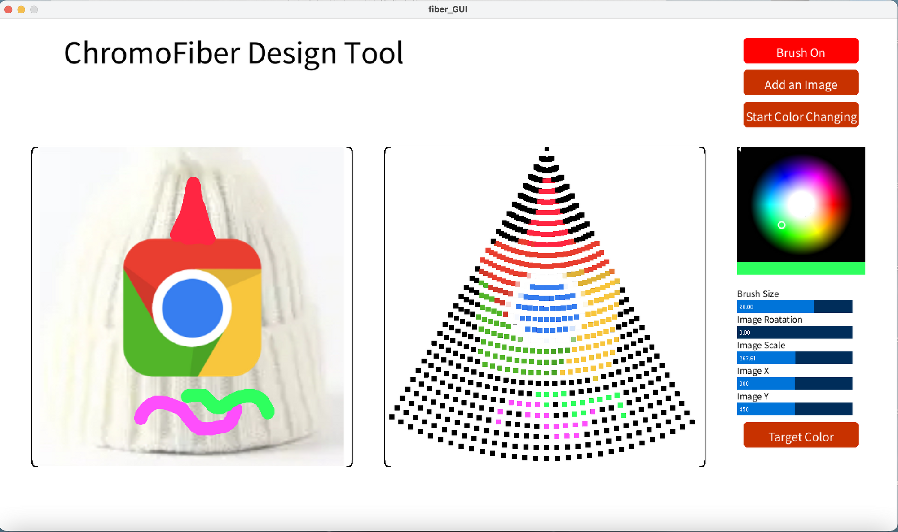

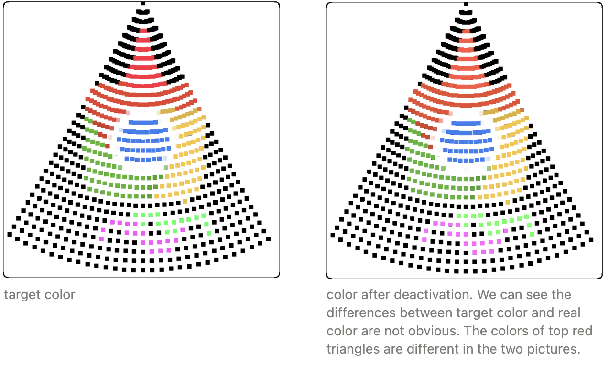

**Algorithm for color gradient calculation**

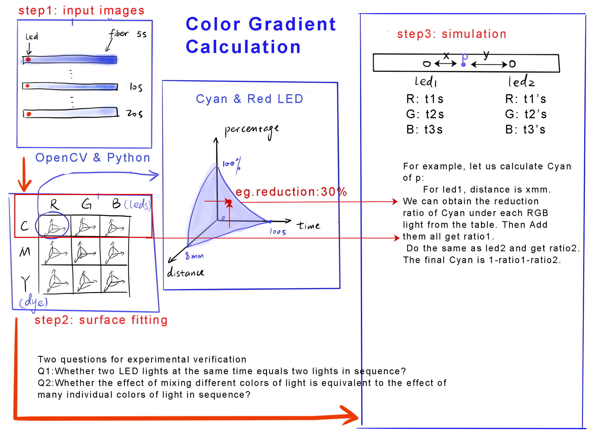

Step 1: shoot photos ( cyan under red, green, blue light for x s)

step 2: use OpenCV to extract the data and fit the surfaces.

step3: calculate the color between the LEDs.

**Color Gradient Viewer**

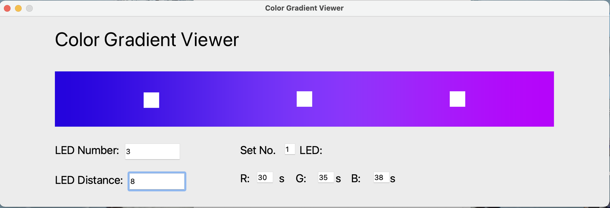

sers can input the flashing time of a different color for each LED.

### [0807 demo of Fiber Calibration Tool and design tool](https://plausible-bard-9b1.notion.site/0807-demo-of-Fiber-Calibration-Tool-and-design-tool-87c51532211c4bbfbdc3feadc5619bb6)

Youtube link for demo: https://youtu.be/jWNFN9iuoOI

This is the workflow of the chromo Fiber project. It contains three parts: Chromofiber Calibration Tool, Chromo Fiber Design Tool and a Linear Programming Solver. 


**Details for design tool and calibration tool**

The position of each LED is marked with a red circle.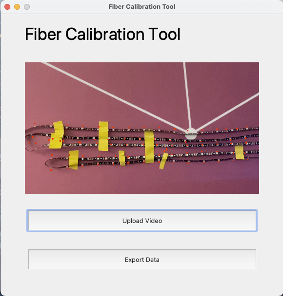

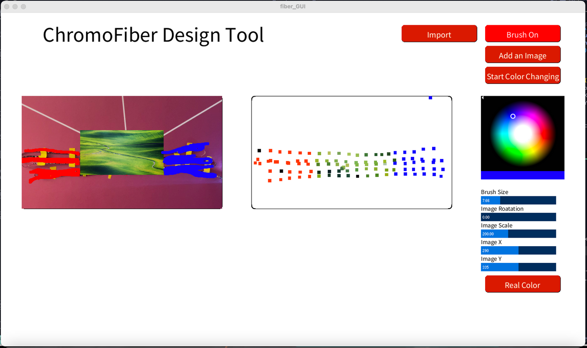


**Color Changing**

After the user clicks on the ‘Start Color Changing’ button, the LED will change according to the pattern.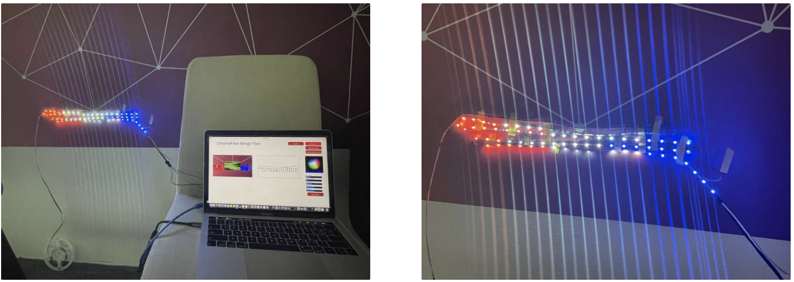


### [0902 LED stripe display](https://plausible-bard-9b1.notion.site/0902-LED-stripe-display-dd8e6caffd8f4602b9d415ded9af59ab)

change button to “Upload Scanned Video”, add position of each LED

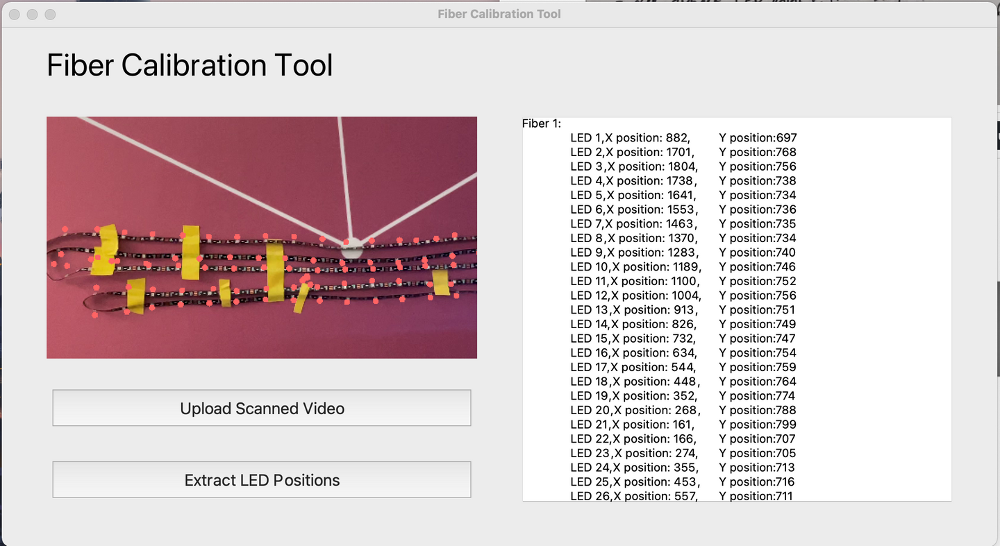

1. change single LEDs to LED stripe by interpolation
2. group UI component according to the function

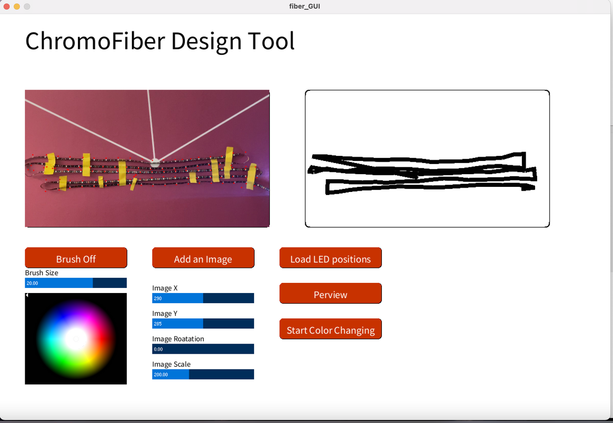

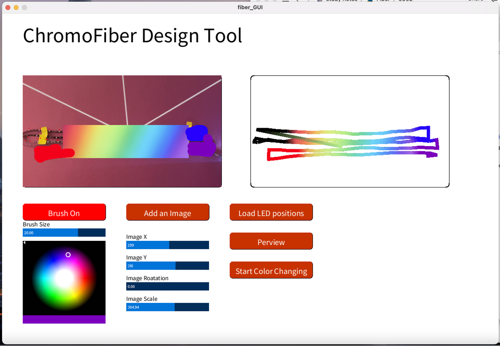

### [0909 merge window and display fiber on background](https://plausible-bard-9b1.notion.site/0909-merge-window-and-display-fiber-on-background-e5994965aef64d0085f63220be45b304)

I merged the window into one and drew the fiber on the background image to make it more real. I tried to let the

Users only draw in the area of fiber instead of the whole canvas. It really makes the interface more intuitive! I removed all the widgets about the image. Users can also create beautiful patterns with a brush without an image.

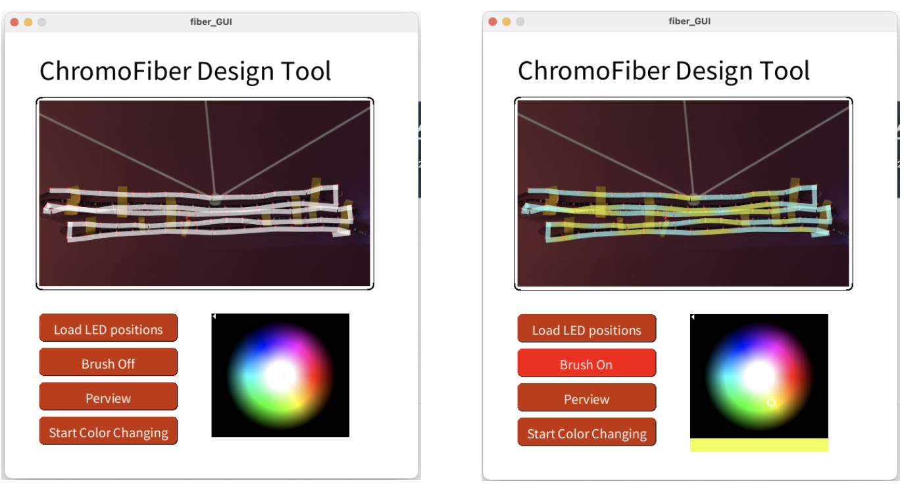

### [0910 instruction of running code](https://plausible-bard-9b1.notion.site/0910-instruction-of-running-code-8c4b2a2757cb4dbaada19a32d7cf13a5)

1. run FiberGUI/camera/testLed/testLed.ino to get video of LED stripe. You need to fix the camera.
2. run camera/videoProess/fiberCalibrationTool.py to input video, save the ledPos.txt(can place it in the same folder of fiber_GUI.pde) and background image.
3. run Fiber_GUI/fiber_GUI/solver.py to start the linear programming solver
4. run Serial/testSerial/testSerial/testSerial.ino to set up Arduino and LED stripe for color changing. You need to define the data_pin according to which PIN the LED stripe is connected with ESP32.

```
#define DATA_PIN    7 //Pin for data on LedStrip
```

5. in  fiber_GUI, set the Serial.list[x] for Arduino. If you just want to test the design tool, you can set it to a number less than the length of Serial.list(). You can see the name of Serial in the result printed by printArray(Serial.list())

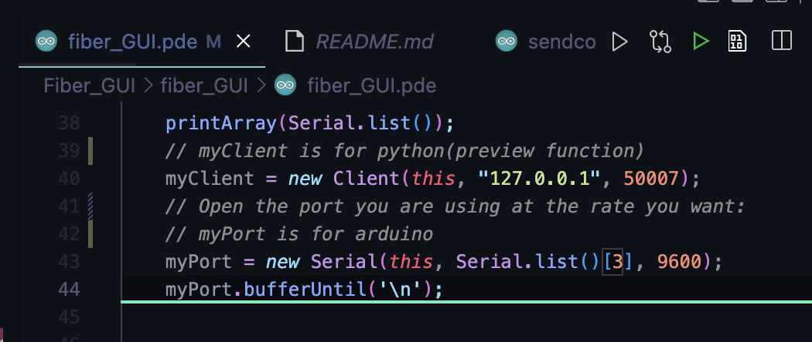


### [A tool to capture the flash of light](https://plausible-bard-9b1.notion.site/0911-get-images-from-video-a7d9e26d96cd474cb5b0e6820928cd06)

 OpenCV to capture the flash of light. I used it to get 233 photos in a video of a cyan fiber being illuminated with blue light. You need to change the parameters before running the code

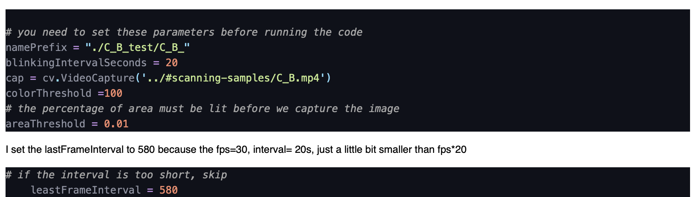


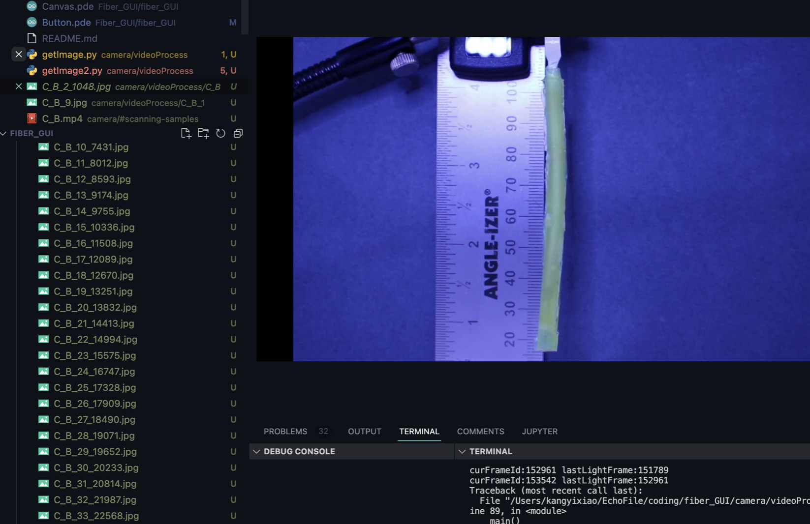

### [0913 Color Picker mode and the preview result with new deactivation data](https://plausible-bard-9b1.notion.site/0913-Color-Picker-mode-and-the-preview-result-with-new-deactivation-data-50fa300363ed446fb648112a61c36db4)

I added a button to select between “Color Picker Mode” and “Color Wheel Mode”, users can choose black, white, cyan, yellow for the brush color.

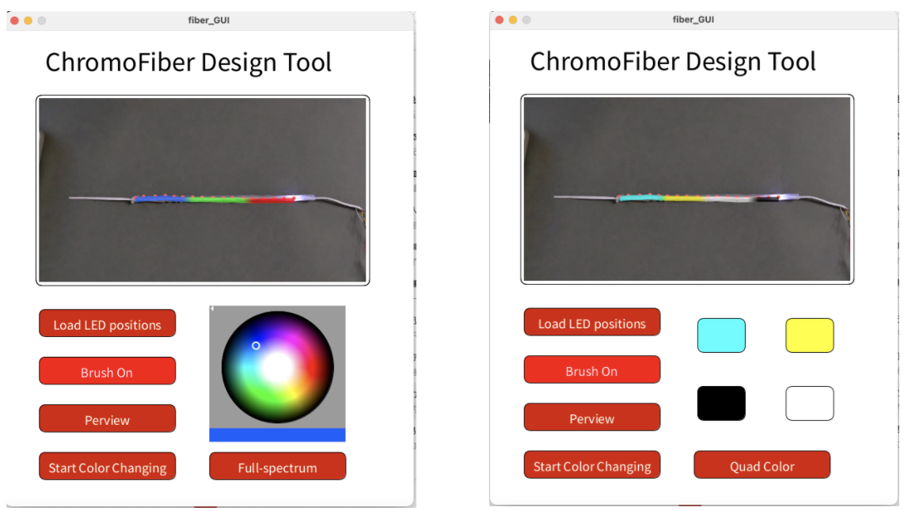

I put the new deactivation data in to linear programming solver and test the preview result.

inf= 1000000 FULL_DEACTIVATION_TIME = [[3500,2000,3600],[2000,2000,1000],[inf,4500,60]]

The red color can not be simulated well by our fiber. The green and blue colors can be simulated well.

Currently, there is no constrains on the LED shining time. We can add more constrains to the solver to see the results.

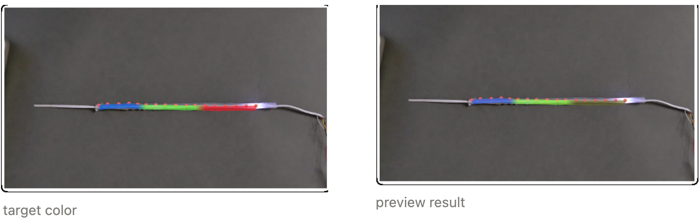

### [20220826 Hexagon fiber and add image back](https://plausible-bard-9b1.notion.site/20220826-Hexagon-fiber-and-add-image-back-bae18275ed81468ebb6da2efa32007b1)

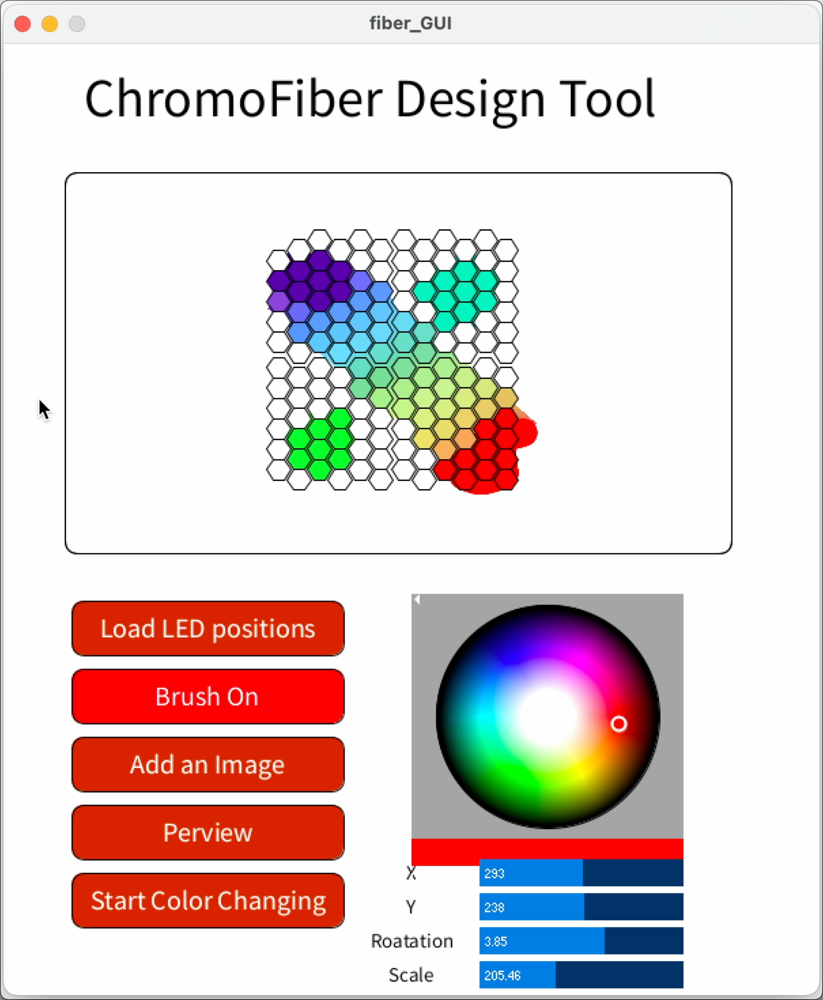

1. Change LED shape from rectangle to hexagon
2. Add the Image back and the sliders
3. Initialize the fiber with a given shape rather than load LED positions.
4. Disable the color picker mode
