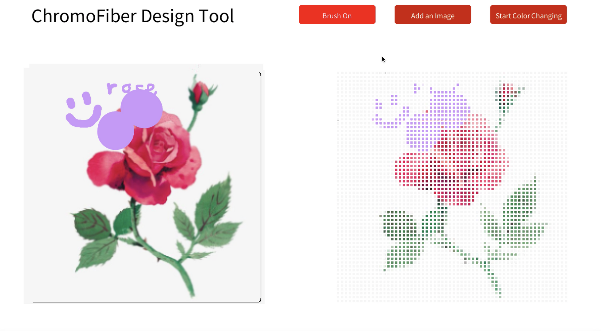
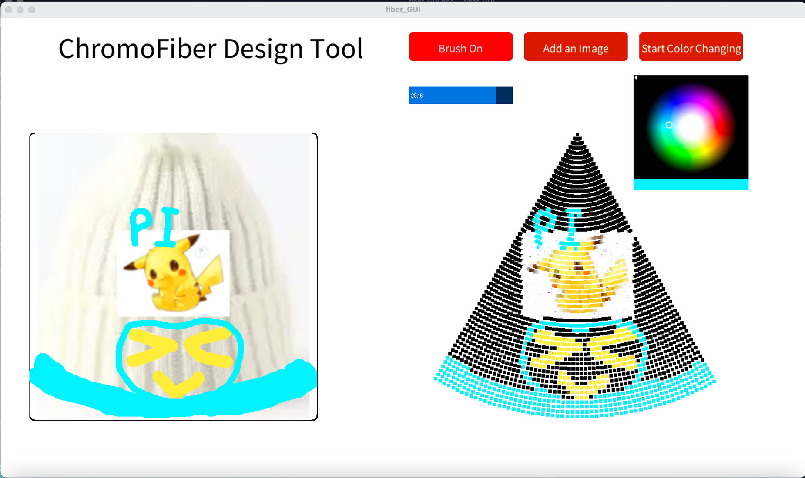
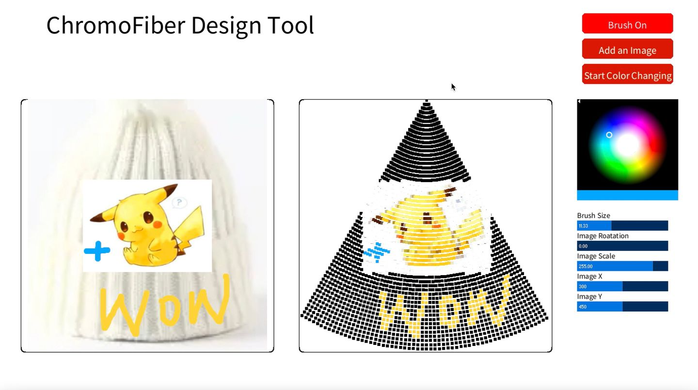
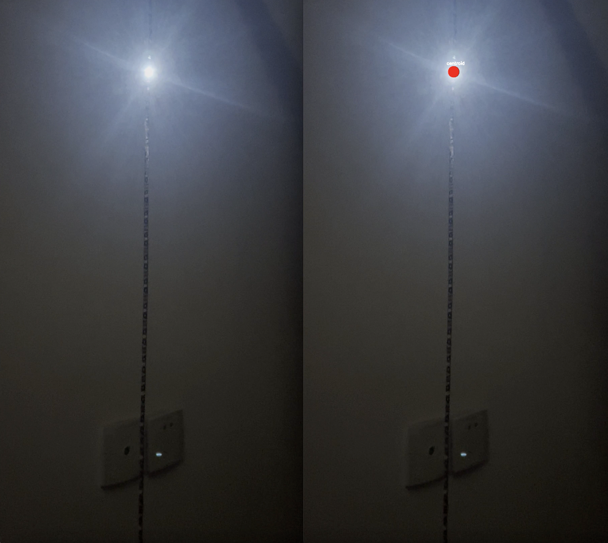
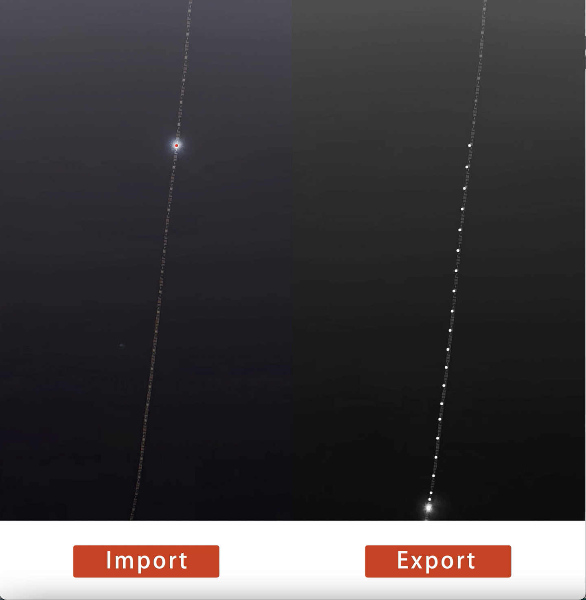
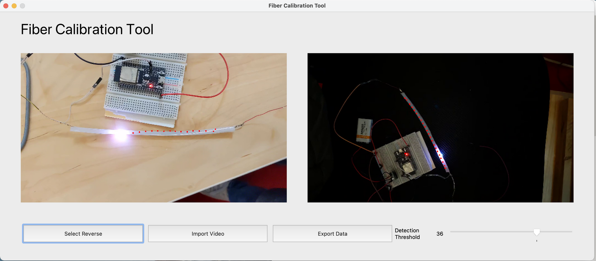
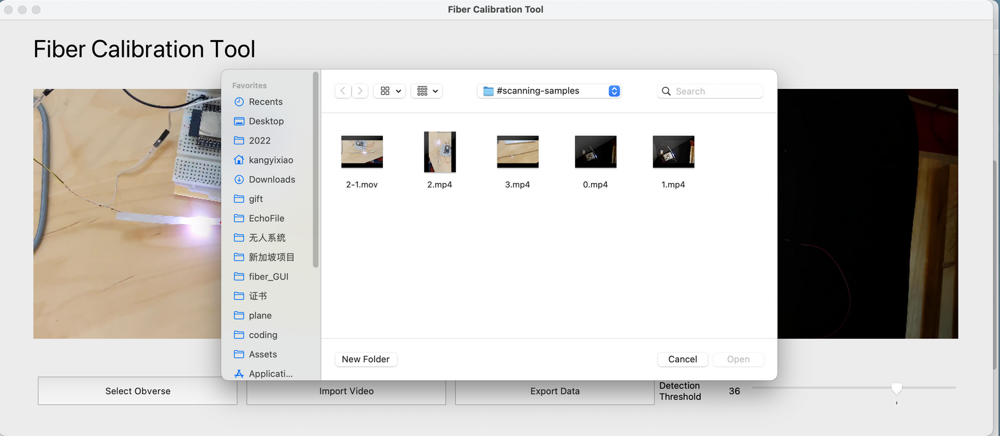
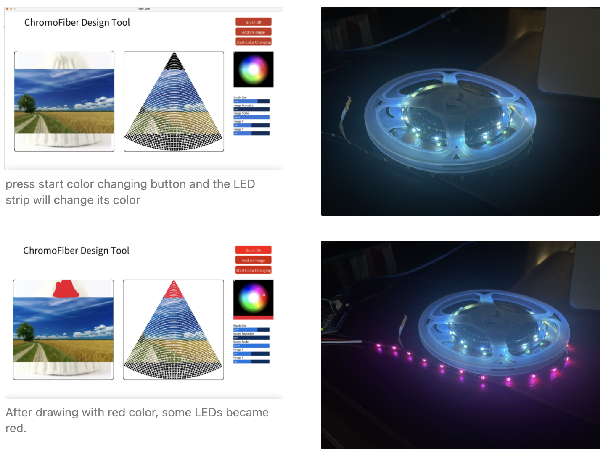
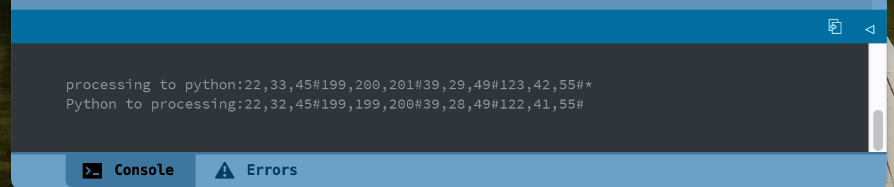

# ChromoFiber Design Tool
[ChromoFiber Design Tool (processing version)](https://github.com/echo-xiao9/FiberGUI/tree/main/Fiber_GUI/fiber_GUI)

[ChromoFiber Design Tool (python version)](https://github.com/echo-xiao9/FiberGUI/tree/main/chromofiber-ui)

[LED Locator (OpenCV version , users can observe The process of generating results)](https://github.com/echo-xiao9/FiberGUI/tree/main/camera/videoProcess)

[Fiber Clibration Tool (OpenCV with PyQt5, add GUI to LED Locator)](https://github.com/echo-xiao9/FiberGUI/tree/main/camera/videoProcess/fiberCalibrationTool.py)

[LED stripe controller(Arduino version)](https://github.com/echo-xiao9/FiberGUI/blob/main/camera/testLed/testLed.ino)

## Dev log

[TOC]

###  [0522 image and brush](https://plausible-bard-9b1.notion.site/0522-demo-chomofiber-image-and-brush-1b8427c226a64868a4369fe13cd45b8a)

### [0608 update GUI（brush, images, color wheel）and possible solutions for the solver](https://plausible-bard-9b1.notion.site/0608-update-GUI-brush-images-color-wheel-and-possible-solutions-for-the-solver-715ab7c91f354250b07e4760623ae1bb)

### [0626 Keyboard operation to UI interface](https://www.notion.so/0626-Keyboard-operation-to-UI-interface-4d31e34366b24dd4b65a90a78796f767)

Keyboard operation(change image position and rotation) → controlled by sliders

### [0630 LED stripe and esp32 Setup, OpenCV get the centroid](https://www.notion.so/0630-LED-stripe-and-esp32-Setup-OpenCv-get-centroid-d51e78c0fc77469698504de7a42d9d22)

### [0704 Designer GUI](https://www.notion.so/0704-Designer-GUI-74f6c075fbb3463ba10361dfada96e68)

[0704findLed.mov](https://s3-us-west-2.amazonaws.com/secure.notion-static.com/337f6e02-bfe8-467d-8774-a5383d44cf1c/0704findLed.mov)

blinking interval: 0.4s

left : original video clip

right : the detection result with opencv

output the position of each led

The method of selecting keyframes:

1. get fps from opencv and flashing period from arduino code(0.4s), flashingInterval = 0.4 * fps

2. the opencv program disposes the video clip frame by frame

3. record the frame number when the first led lights up as startFrame

4. **curFrame -(curLED \* flashingInterval)-startFrame < 0.5 and curFrame -(curLED \* flashingInterval)-startFrame >- 0.5 :**

   **select it !**

### [0710 Fiber Calibration Tool ](https://www.notion.so/0710-Fiber-Clibration-Tool-c5de2f8537d044d68c0f1f24af977c77)

demo video: [0710FiberCalibrationToolv1.mov](https://s3-us-west-2.amazonaws.com/secure.notion-static.com/d5a5fe84-4483-4c23-a6eb-ae1888797689/0710FiberCalibrationToolv1.mov)

Users can select Obverse/ Reverse by clicking the button. The result will show on the corresponding window.

Users can drag the slider to control the threshold.

Press Import Video button→ choose a video from a new dialog

### [0717 Linear Programming and Control fiber with processing](https://plausible-bard-9b1.notion.site/0717-Linear-Programming-and-Control-fiber-with-processing-831b898c91314319b801d3585a6dde31)

youtube link:https://youtu.be/ei8W3mmJWns

- [x]  deactivation with linear programing:  communicate with python and get read color
- [ ]  put updated color to canvas
- [x]  control fiber with processing
- [x]  double-faced (arduino, processing, python)

#### Control fiber with processing

Successfully implement processing and Arduino communication with Serial

#### adeactivation with linear programing

let processing communicate with python

This is a screenshot of processing terminal.

use scipy in python for linear programming
